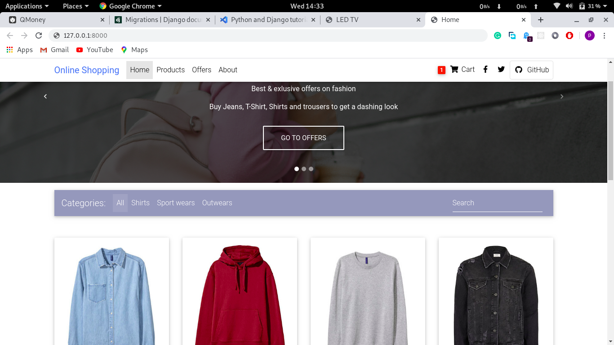
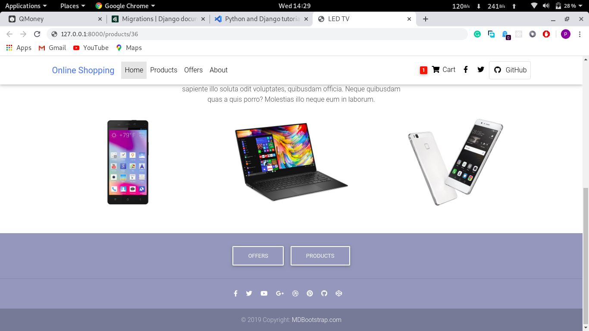
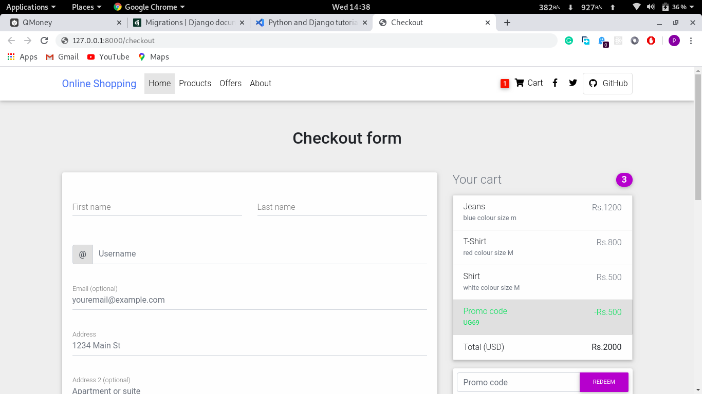

# Online Shopping Clone

This is an online shopping website built with Django. The website displays products from where users can add and remove products to/from their cart while also specifying the quantity of each item. They can specify their billing and shipping adrress, select a default shipping and billing address, save a card.

### APIS
Payment is handled by [Stripe api](https://stripe.com/en-in).

### APPS USED
- [crispy forms](https://django-crispy-forms.readthedocs.io/en/latest/)
- [django allauth](https://django-allauth.readthedocs.io/en/latest/overview.html)
- [django countries](https://github.com/SmileyChris/django-countries)

### Template Used
- [MDBootstrap](https://mdbootstrap.com/)

### Snaps

